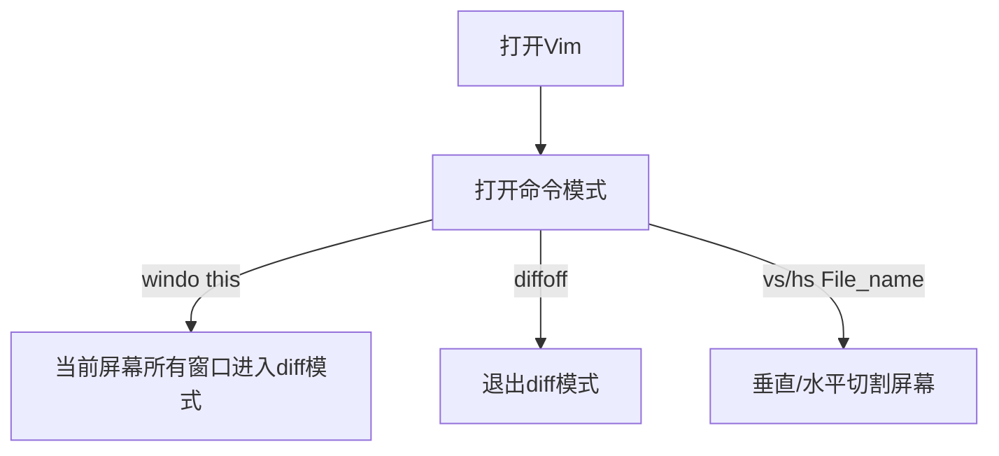
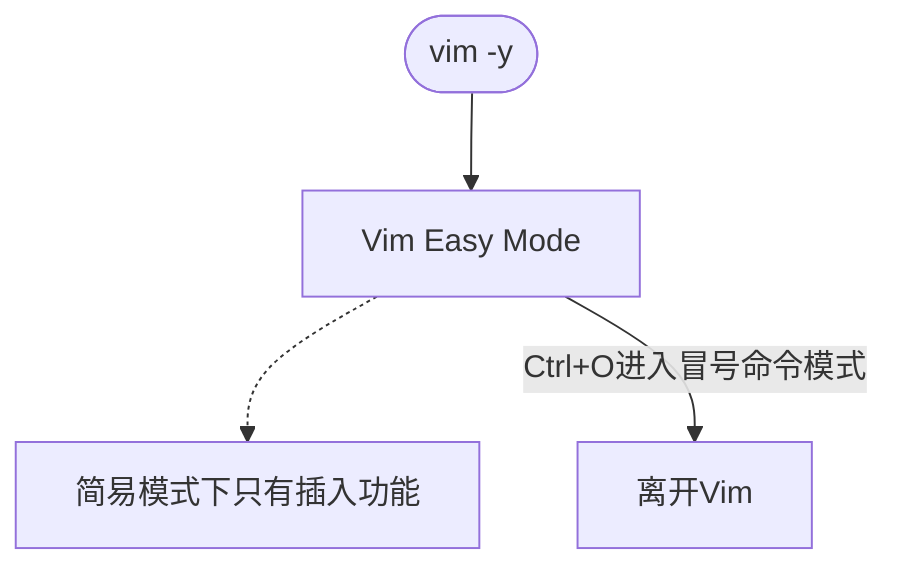
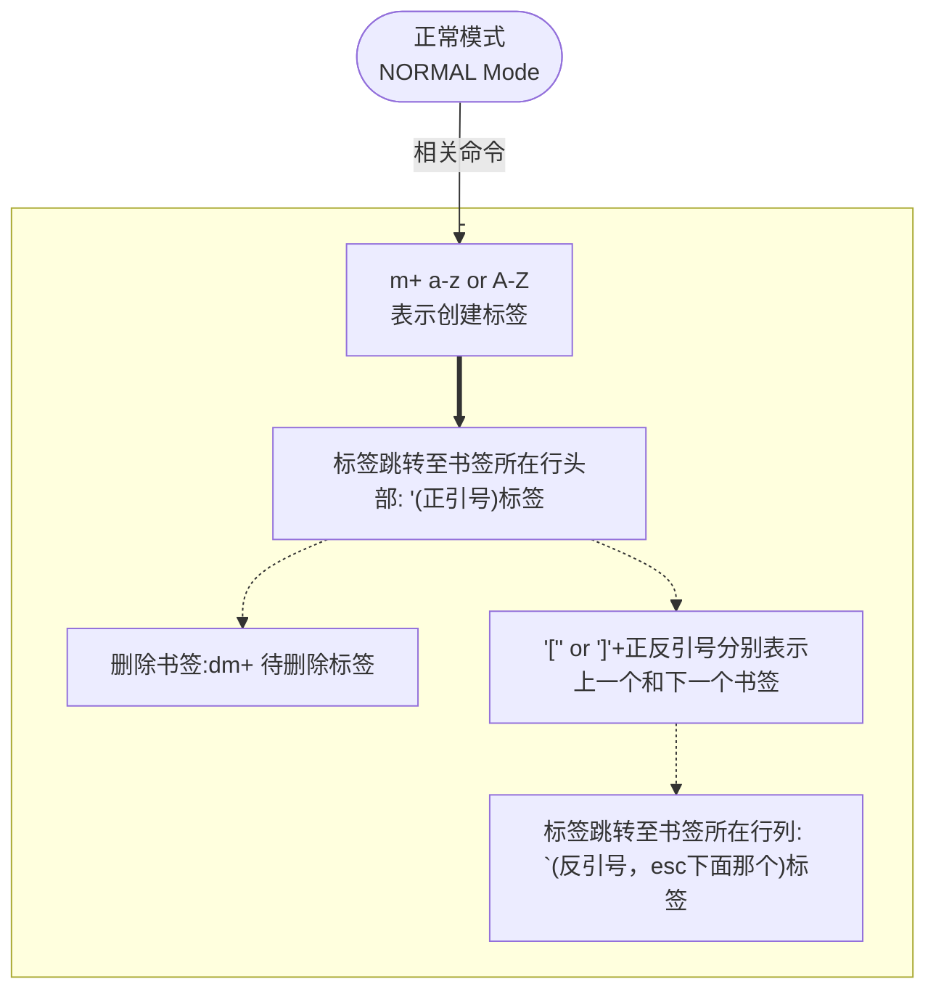
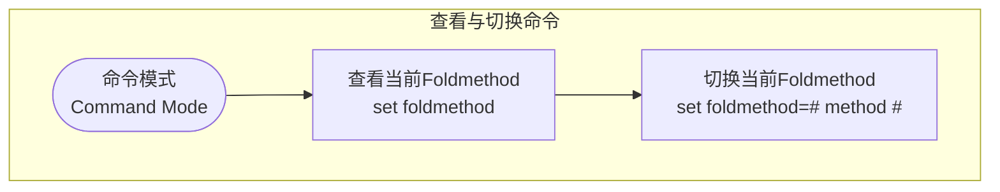
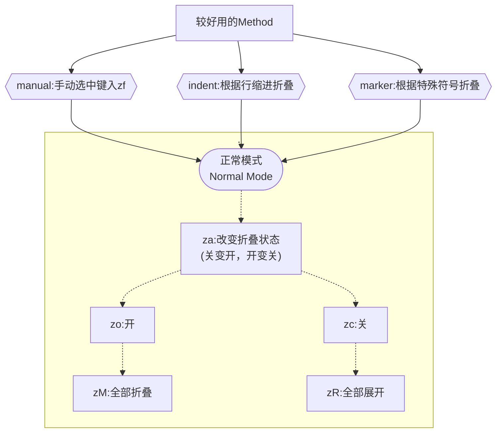

# <font color=LightBlue>目录</font>

- <a href=#715753497>外部命令</a>
- <a href=#900237984>特殊字符</a>
- <a href=#646676535>光标跳转</a>
- <a href=#728782474>对比文件</a>
- <a href=#1125457273>简易模式Vim</a>
- <a href=#15038039>打开Vim后运行指定命令</a>
- <a href=#-1463670626>获取命令返回值直接带入Vim</a>
- <a href=#653784>书签</a>
- <a href=#773248134>折叠功能</a>

------

## <a id="715753497">外部命令</a>

命令模式下（冒号：）

输入 ！+ 命令 相当于运行该命令

输入 .! + 命令 相当于将命令的输出值带回Vim

▲ figlet会将输入的字母转为字符画

## <a id="900237984">特殊字符</a>

输入<a id="900237984">特殊字符</a>

**Insert模式**下使用

| 快捷键    | 对应应用          |
|:------:|:------------- |
| Ctrl+v | AscIi码        |
| Ctrl+k | 双生字符（比如*1表示⭐） |

## <a id="646676535">光标跳转</a>

- 跳转至对应行
  
  ```bash
  vim +行数（有一个加号！）文件名  
  ```

- 跳转至对应内容位置
  
  ```bash
  vim +/正则 文件名
  ```


## <a id="728782474">对比文件</a>

- 外部打开
  
  为vim指令添加-d选项，跟两个文件名进入<mark>diff模式</mark>，打开两个缓冲区。

```bash
vim -d file1 file2
```

- 内部对比
  
  先垂直分割屏幕，再对屏幕中的所有缓冲区执行differthis。 



## <a id="1125457273">简易模式Vim</a>



## <a id="15038039">打开Vim后运行指定命令</a>

```bash
vim -c "命令" File
```

or

```bash
vim "+ 命令" File
```


## <a id="-1463670626">获取命令返回值直接带入Vim</a>

```bash
<command> | vim -
```

“-” 符号表示从标准输出（屏幕打印）中读取

## <a id="653784">书签</a>



### [Using marks | Vim Tips Wiki](https://vim.fandom.com/wiki/Using_marks)

## <a id="773248134">折叠功能</a>



### Method

- `manual` – folds must be defined by entering commands (such as [zf](http://vimdoc.sourceforge.net/cgi-bin/help?tag=zf))

- `indent` – groups of lines with the same indent form a fold

- `syntax` – folds are defined by syntax highlighting

- `expr` – folds are defined by a user-defined expression

- `marker` – special characters can be manually or automatically added to your text to flag the start and end of folds

- `diff` – used to fold unchanged text when viewing differences (automatically set in diff mode)



### [Folding | Vim Tips Wiki ](https://vim.fandom.com/wiki/Folding)

> #### 组合技：vim "+ : set foldmethod=marker" hadoop-env.sh

打开时自动将文本的foldmethod调为marker

 <font color=Red>:imp:Error</font>

<font color=Red>还是尽量不要使用<a id="773248134">折叠功能</a>的marker，会导致部分的字符Error！</font>
